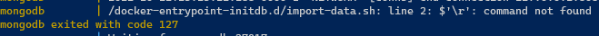
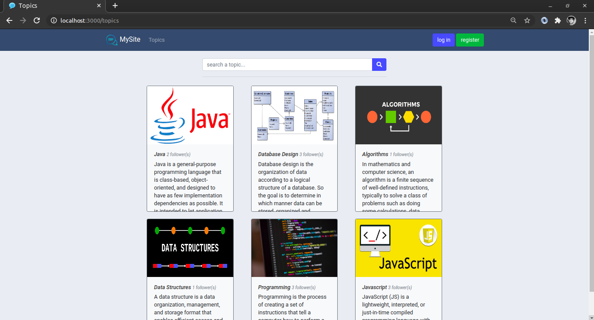
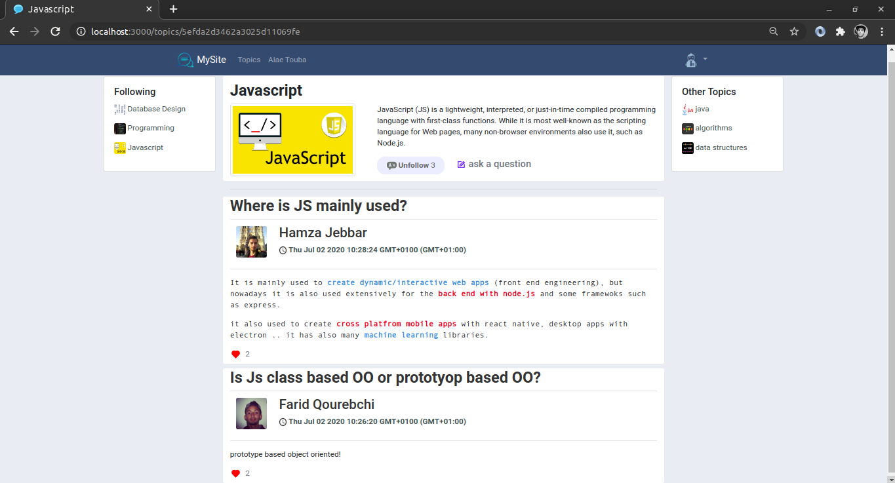
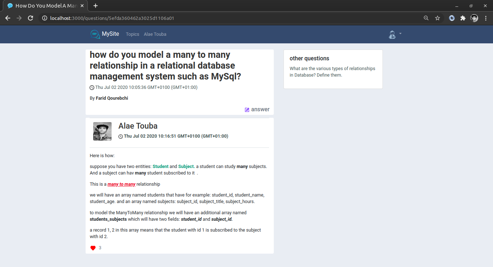
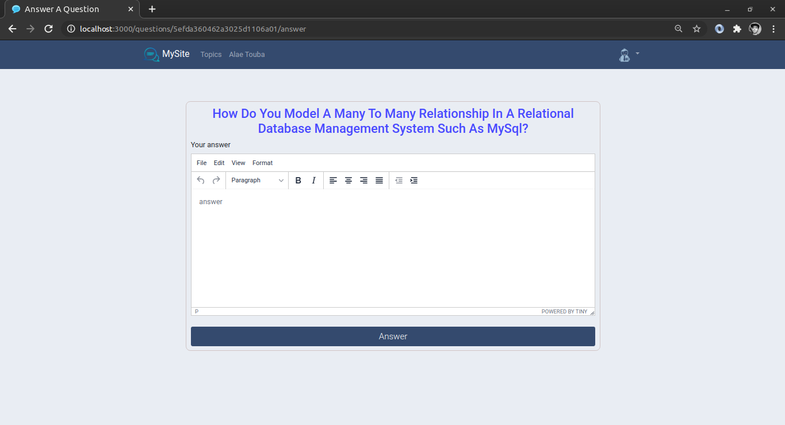
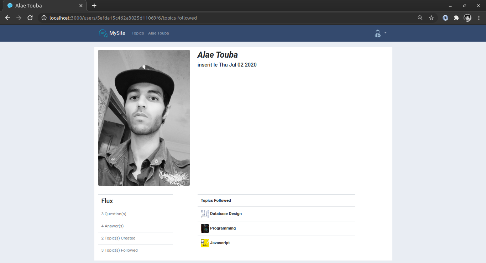
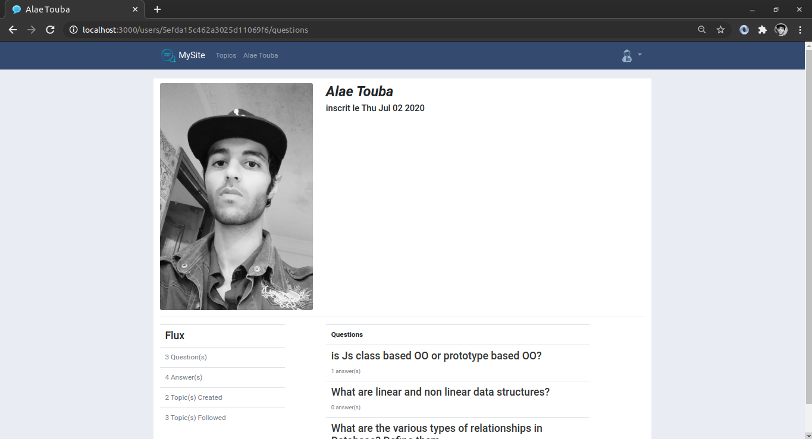
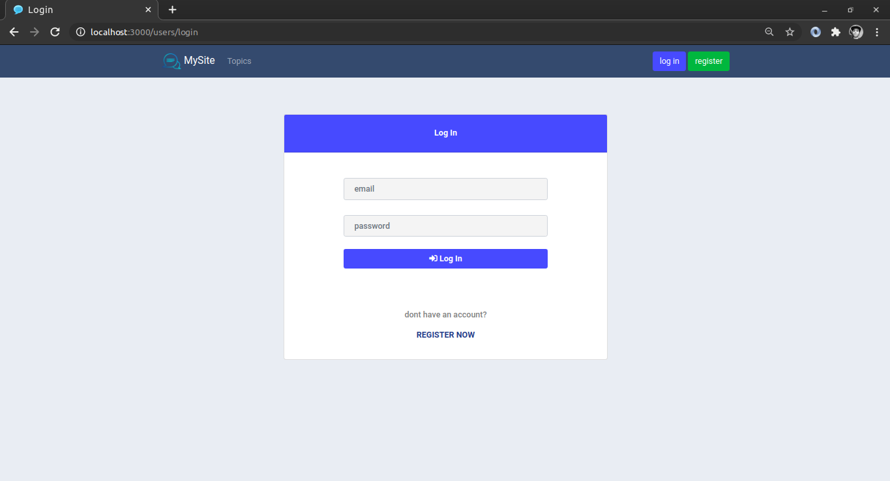
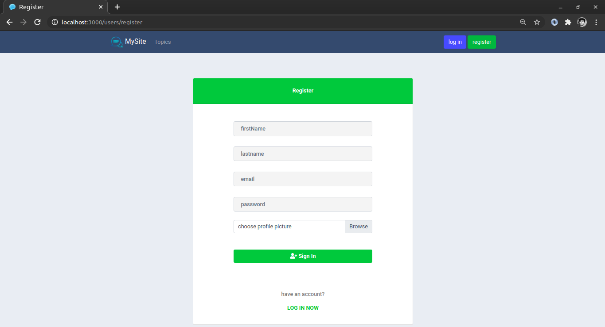

# Table of content
- [Table of content](#table-of-content)
- [About](#about)
- [Entity Relationship Diagram](#entity-relationship-diagram)
- [Modeling Data - Relationships Between The 4 Models](#modeling-data---relationships-between-the-4-models)
- [Mongoose Schemas](#mongoose-schemas)
- [API](#api)
- [Use it locally](#use-it-locally)
  - [Using docker](#using-docker)
  - [Detailed steps on how to run the application locally in Linux](#detailed-steps-on-how-to-run-the-application-locally-in-linux)
  - [Detailed steps on how to run the application locally in Windows](#detailed-steps-on-how-to-run-the-application-locally-in-windows)
- [How It Looks](#how-it-looks)

# About

This is a _question-and-answer_ social network website where users are able to:

-   Create and follow different topics
-   Ask questions in these topics
-   Answer questions and like/dislike answers.
-   Track other users in the website to see what questions someone asked, what answers he/she gave, which topics they follow, ...etc


# Entity Relationship Diagram

Here is the _ERD_ for this app:


# Modeling Data - Relationships Between The 4 Models

A user has many topics (create)\
A topic belongs to one user \
=> one to many

A user has many questions (ask) \
A question belongs to one user \
=> one to many

A user has many answers (answer) \
An answer belongs to one user \
=> one to many

A topic has many questions \
A question belongs to one topic \
=> one to many

A question has many answers \
An answer belongs to one question \
=> one to many

A user can follow many topics (follow) \
A topic has many followers \
=> many to many

An answer has many users who like it \
A user can like many answers \
=> many to many


# Mongoose Schemas

I use two way (parent & child) referencing for all relationships:

```
User{
    _id             : ObjectId
    firstName       : String
    lastName        : String
    email           : String
    password        : String
    imageName       : String
    registrationDate: Date
    topics          : Topic[]       //we store the topics ids
    questions       : Question[]    //same
    answers         : Answer[]
    topicsFollowed  : Topic[]
    answersLiked    : Answer[]
}
```

```
Topic{
    _id             : ObjectId
    name            : String
    description     : String
    imageName       : String
    creationDate    : Date
    user            : User
    questions       : Question[]
    usersFollowers  : User[]
}
```

```
Question{
    _id             : ObjectId
    content         : String
    creationDate    : Date
    topic           : Topic
    user            : User
    answers         : Answer[]
}
```

```
Answers{
    _id             : ObjectId
    content         : String
    creationDate    : Date
    user            : User
    question        : Question
    usersWhoLike    : User[]
}
```

---


# API

```
GET    /users
GET    /users/:id
GET    /users/:id/:content (content == questions | answers | topics | topics-followed)
GET    /users/register
GET    /users/login
POST   /users/register
POST   /users/login
DELETE /users/logout
```

```
GET    /topics
GET    /topics/:id
GET    /topics/create
POST   /topics/create
GET    /topics/:id/question
POST   /topics/:id/question
DELETE /topics/:id              //NIY
PATCH  /topics/:id              //NIY
POST   /topics/follow-infollow  //NIY
```

```
GET    /questions/:id
GET    /questions/:id/answer
POST   /questions/:id/answer
DELETE /questions/:id           //NIY
PATH   /questions/:id           //NIY
```

```
POST   /answers/like-unlike
GET    /answers/:id             //NIY
DELETE /answers/:id             //NIY
PATH   /answers/:id             //NIY
```

(NIY <=> Not Implemented Yet )


# Use it locally

## Using docker

* Clone the project & unzip it
* Open the project in the terminal

* Run 
    ```bash
    docker compose up
    ```

    if you watch the logs you may see this error:

    

    This is related to EOL (end of line) difference between Windows & Linux systems. If you are cloning the project in Windows Machine, change the EOL for the file [mongodb-database/import-data.sh](./mongodb-database/import-data.sh) to be LF (\n).

    In VSCODE you can do this easily by looking at the bottom menu when the file is opened.

    

* Open a browser & head to http://localhost:8082 to see the content of the database (**social_network_db**)

    you should see 4 collections (users, topics, quetions, answers), each one with some data in it.
    
    If its not the case, refer to previous step (error may be related to EOL for the [mongodb-database/import-data.sh](./mongodb-database/import-data.sh)).

* Visit http://localhost:3001 to see the app running
* You can log in to the website with a bunch of existing accounts: 
    * alae@gmail.com/ alae
    * hamza@gmail.com/hamza
    * farid@gmail.com/farid

    or just create one for you instead.


## Detailed steps on how to run the application locally in Linux

* To install Nodejs, visit this link https://github.com/nodesource/distributions/blob/master/README.md

    Go to *Debian and Ubuntu based distributions* section and find the wanted Nodejs version and run the commands. For example, if you want to install Nodejs version 12, you will run:

    ```bash
    # Using Ubuntu
    curl -fsSL https://deb.nodesource.com/setup_12.x | sudo -E bash -
    sudo apt-get install -y nodejs
    ```

* Install MongoDB database via
    ```bash
    sudo apt install mongodb
    ```

* Start the MongoDB service via:
    ```bash
    sudo service mongodb start
    ```

* You can check if MongoDB service is active using:
    ```bash
    sudo systemctl status mongodb
    ```

* Now its time to create the database and its collections, to do this, open the mongo shell using:
    ```bash
    mongo
    ```

* From the mongo shell, run these commands one after another:
    ```bash
    use social_network_db
    db.createCollection('users')
    db.createCollection('questions')
    db.createCollection('answers')
    db.createCollection('topics')
    ```
* Download the project into the filesystem 

* Unzip it

* Now we need to import the data into the mongodb database collections

* Open a terminal & go to the downloaded project's directory & run the following commands one after another
    ```bash
    mongoimport --db social_network_db --collection users --drop --file ./mongodb-database/users.json --jsonArray
    ```

    ```bash
    mongoimport --db social_network_db --collection questions --drop --file ./mongodb-database/questions.json --jsonArray
    ```

    ```bash
    mongoimport --db social_network_db --collection answers --drop --file ./mongodb-database/answers.json --jsonArray
    ```
    
    ```bash
    mongoimport --db social_network_db --collection topics --drop --file ./mongodb-database/topics.json --jsonArray
    ```
* Always from the project's directory, run 
    ```bash
    npm install
    ```
    to install npm dependencies

* ALways from the project's directory, run:
    ```bash
    npm run startdev
    ```
    To run the app

* go to http://locahost:3000

* You can log in to the website with a bunch of existing accounts (email/password): 
    * alae@gmail.com / alae
    * hamza@gmail.com / hamza
    * farid@gmail.com / farid

## Detailed steps on how to run the application locally in Windows


* MongoDB/Nodejs Download & install

    * To download Nodejs for windows, follow the link https://nodejs.org/en/download/ and use the installer and follow the installation steps
  
    * Download MongoDB for Windows from the link https://www.mongodb.com/try/download/community

    * Run the .msi file to run the installation wizard (leave everything as default.. default is BEST)

    * Create this directory structure **C:\data\db**

    * Go to MongoDB installation folder and somewhere there in the directory structure you will find a **bin** folder, add it to the *PATH* env variable .
   
    * Now we need to download The MongoDB Database Tools (colleciton of command-line utilities for working with MongoDB), to do this head to https://www.mongodb.com/try/download/database-tools?tck=docs_databasetools and download the zip file 
    
    * Extract the zip under C:\ drive 
    
    * under this zip, you will find a **bin** folder, add it to the *PATH* env variable    

* Running MongoDB server and importing the data into the database
    * Open cmd and run the MongoDB deamon using this command:
       
        ```bash
        .\mongod.exe
        ```

    * Now we need to create the database and its collections, open cmd run the MongoDB client
        ```bash
        .\mongo.exe
        ```

    * From the mongo shell that appears, run the following commands one after another

        ```bash
        use social_network_db
        db.createCollection('users')
        db.createCollection('questions')
        db.createCollection('answers')
        db.createCollection('topics')
        ```

    * The rest of the steps to import the data and run the app are the same as in Linux

   

# How It Looks
















